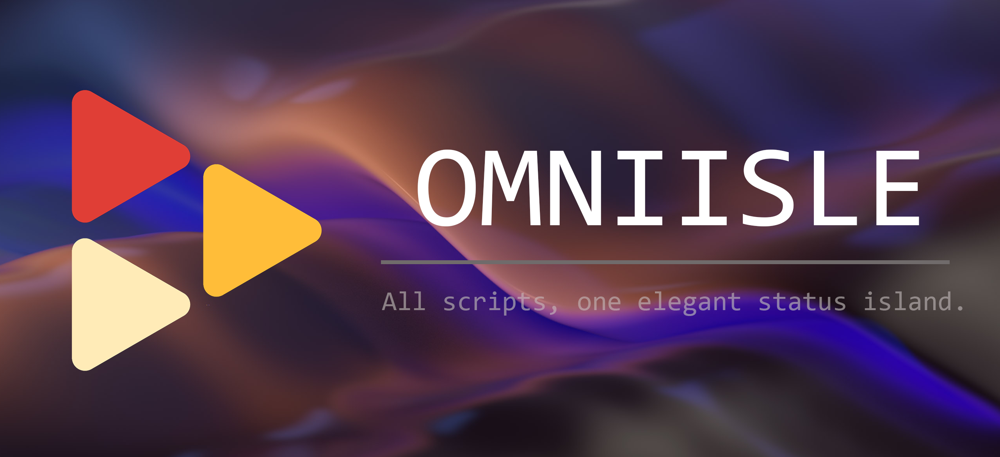

# OmniIsle



[简体中文](README.zh-CN.md)

OmniIsle is a Windows desktop tool that runs personal scripts from the right-click context menu and shows runtime status in a Dynamic Island style floating panel.

## Features

- Windows right-click integration (current user only, HKCU)
- Script execution with target file/folder path passing
- Floating island UI with queue/log/status display
- Safe install/uninstall registry utility

## For EXE Users (No Development Setup)

This section is for users who only run the packaged app and do not use source code.

### 1) Install and launch

- Run installer: `OmniIsle_0.1.0_x64-setup.exe` or `OmniIsle_0.1.0_x64_en-US.msi`
- Launch `OmniIsle` from Start Menu (or by running `omniisle.exe`)

### 2) Basic usage flow

- Open OmniIsle settings panel
- Add script entries in script management (example: `hello.py`)
- Enable right-click menu integration
- In Explorer, right-click a file or folder and select an OmniIsle script
- Watch run status/log in the floating panel

### 3) Where user data is stored

- App settings file: `C:\Users\<username>\.omniisle\app_configs.json`
- Runtime user data root (default): `%LOCALAPPDATA%\OmniIsle`
- Runtime folders/files include:
	- `scripts/`
	- `logs/`
	- `tmp/`
	- `env_config.json`
	- `scripts_config.json`

### 4) Common notes

- On Windows 11, right-click entries may appear under `Show more options`
- Right-click menu scope is current user only (`HKCU`)
- If right-click entry is missing, open OmniIsle and re-enable context menu integration once

## Tech Stack

- Desktop container: Tauri v2 (Rust)
- UI: React + TypeScript + Framer Motion
- Script runtime: Python via Rust process execution

## Quick Start (Dev)

### 1) Frontend + Tauri dev mode

```powershell
cd omniisle-tauri
npm install
npm run tauri:dev
```

### 2) Build release app

```powershell
cd omniisle-tauri
npm install
npm run tauri:build
```

Release executable is generated at:

`omniisle-tauri/src-tauri/target/release/omniisle.exe`

## Context Menu Install/Uninstall

Install right-click menu (safe: HKCU only):

```powershell
python tools/windows/context_menu_registry.py install --exe "omniisle-tauri\\src-tauri\\target\\release\\omniisle.exe" --config "dev-configs\\scripts_configs.json"
```

Remove right-click menu:

```powershell
python tools/windows/context_menu_registry.py uninstall
```

Notes:

- Scope: `HKCU\\Software\\Classes\\...` (no machine-wide writes)
- Windows 11 may place entries under `Show more options`
- Script menu items come from `dev-configs/scripts_configs.json`

## Project Structure

```text
OmniIsle/
├─ dev-configs/
│  ├─ app_jsons.json
│  ├─ env_configs.json
│  ├─ logs/
│  ├─ scripts_configs.json
│  ├─ tmp/
│  └─ scripts/
│     └─ hello.py
├─ omniisle-tauri/
│  ├─ src/
│  │  ├─ App.tsx
│  │  ├─ App.css
│  │  └─ index.css
│  ├─ dist/
│  ├─ public/
│  └─ src-tauri/
│     ├─ capabilities/
│     ├─ src/
│     │  ├─ main.rs
│     │  └─ lib.rs
│     ├─ icons/
│     ├─ Cargo.toml
│     ├─ Cargo.lock
│     └─ tauri.conf.json
├─ release/
│  └─ setup.exe
├─ tools/
│  ├─ dev/
│  │  └─ setup-dev-template.ps1
│  └─ windows/
│     └─ context_menu_registry.py
├─ LICENSE
└─ README.md
```

## License

See `LICENSE`.


